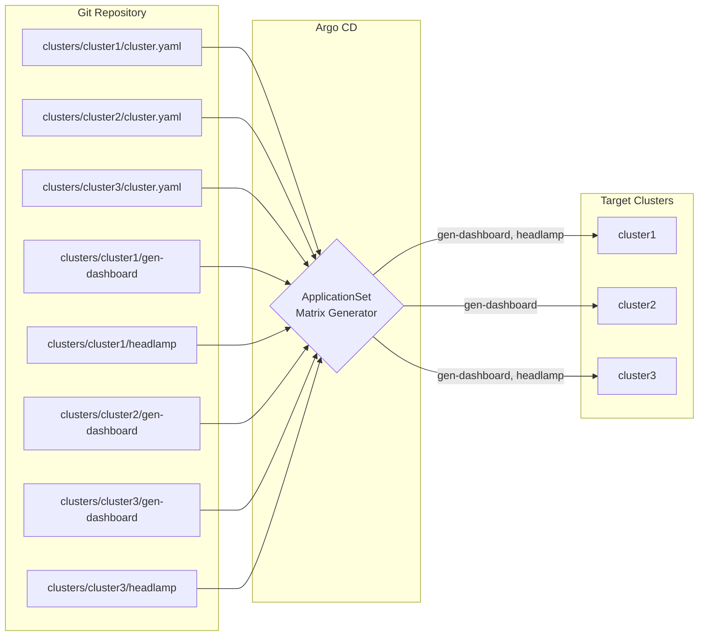
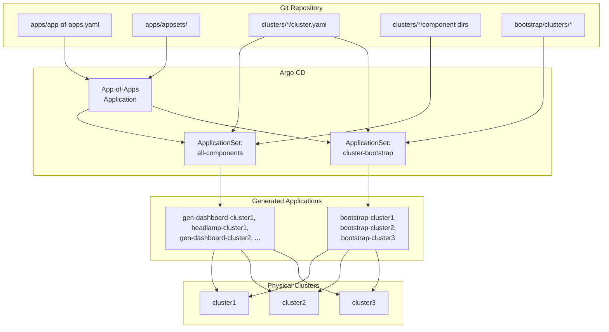
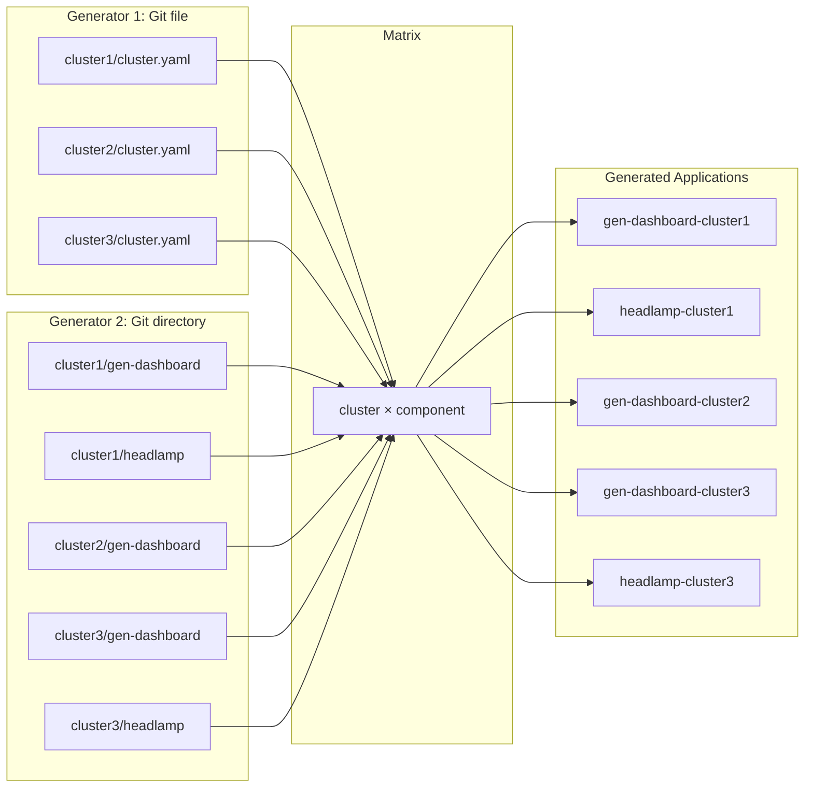

# GitOps Strategy Diagrams — Clusters-from-Git

This document uses a **multi-layered** approach to visualize the relationship between the **Git folder structure**, **ApplicationSet logic**, and **physical clusters** in the Clusters-from-Git strategy.

---

## 1. The Strategy: "The Matrix Generator"

In the Clusters-from-Git model we use a **Matrix Generator**. This is a two-dimensional grid:

| Axis | Meaning | Driven by |
|------|---------|-----------|
| **Where** | Cluster | Git file generator over `clusters/*/cluster.yaml` |
| **What** | Component | Git directory generator over `clusters/{{.clusterPath.basename}}/*` |

- **Cluster list:** Git file generator over `clusters/*/cluster.yaml` — each file defines `name` and `server`.
- **Component list:** Git directory generator over `clusters/{{.clusterPath.basename}}/*` — directories under each cluster = components to deploy.
- **Matrix:** Git (cluster.yaml files) × Git (directories per cluster). No cluster or component list is hard-coded in the ApplicationSet YAML.
- **Optional:** A separate `cluster-bootstrap-appset.yaml` for bootstrap (namespaces, RBAC) with its own sync policy.

---

## 2. Repository Structure (The "Drawing" Blueprint)

Directory tree that drives the GitOps flow in this repo:

```text
.
├── apps/
│   ├── app-of-apps.yaml              ← Bootstrap: syncs all ApplicationSets
│   └── appsets/
│       ├── all-components-appset.yaml   ← Matrix: (cluster × component) → Applications
│       ├── cluster-bootstrap-appset.yaml ← Optional: one Application per cluster (bootstrap)
│       └── README.md
├── bootstrap/
│   └── clusters/
│       ├── cluster1/                    ← Bootstrap manifests for cluster1
│       ├── cluster2/
│       └── cluster3/
├── clusters/
│   ├── cluster1/
│   │   ├── cluster.yaml                 ← (name: cluster1, server: https://...)
│   │   ├── gen-dashboard/               ← Component 1 (values.yaml)
│   │   └── headlamp/                    ← Component 2 (values.yaml)
│   ├── cluster2/
│   │   ├── cluster.yaml
│   │   └── gen-dashboard/
│   └── cluster3/
│       ├── cluster.yaml
│       ├── gen-dashboard/
│       └── headlamp/
└── components/
    ├── gen-dashboard/                   ← Helm chart (shared)
    │   ├── Chart.yaml
    │   └── templates/
    └── headlamp/
        ├── Chart.yaml
        └── templates/
```

**Flow in words:** The ApplicationSet reads `clusters/*/cluster.yaml` to get the cluster list, then for each cluster reads `clusters/<name>/*` to get the component list. It generates one Argo CD Application per (cluster, component) pair, deploying the shared chart from `components/<component>` with overrides from `clusters/<name>/<component>/values.yaml`.

---

## 3. ApplicationSet Logic (Central "Brain")

```
┌─────────────────────────────────────────────────────────────────────────────┐
│                     ApplicationSet: all-components                          │
│                         (Matrix Generator)                                  │
├─────────────────────────────────────────────────────────────────────────────┤
│  Generator 1 (Git file)          Generator 2 (Git directory)                │
│  path: clusters/*/cluster.yaml   path: clusters/{{.clusterPath.basename}}/*  │
│  → cluster1, cluster2, cluster3  → per cluster: gen-dashboard, headlamp…   │
│                                                                             │
│  Matrix = (cluster1×gen-dashboard), (cluster1×headlamp),                    │
│           (cluster2×gen-dashboard), (cluster3×gen-dashboard),                │
│           (cluster3×headlamp)  → 5 Applications (example)                    │
└─────────────────────────────────────────────────────────────────────────────┘
```

Optional bootstrap ApplicationSet:

```
┌─────────────────────────────────────────────────────────────────────────────┐
│                     ApplicationSet: cluster-bootstrap                        │
│                     (Git file generator only)                                │
├─────────────────────────────────────────────────────────────────────────────┤
│  path: clusters/*/cluster.yaml  →  one Application per cluster              │
│  destination: bootstrap/clusters/{{.clusterPath.basename}}                  │
└─────────────────────────────────────────────────────────────────────────────┘
```

---

## 4. Pros & Cons (Comparison Table)

| Strategy Aspect   | Status     | Why |
|-------------------|------------|-----|
| **Scalability**   | ✅ **High** | Adding a cluster = adding a folder + `cluster.yaml`; no YAML edits in Argo CD. |
| **Drift detection** | ✅ **Direct** | Changes in Git are reflected via the Git generator. |
| **Single source of truth** | ✅ **Git** | Cluster list and component-per-cluster list both live in the repo. |
| **Complexity**    | ⚠️ **Medium** | Debugging matrix (cluster × component) logic can be harder than simple lists. |
| **Security**      | 🛡️ **Strong** | RBAC can be applied at the folder level in the Git repo. |

---

## 5. High-Level Flow (Mermaid)

**Git → ApplicationSet (Matrix) → Clusters**



---

## 6. Full Bootstrap Layer (App-of-Apps → ApplicationSets → Clusters)



---

## 7. Matrix Generator Detail (Two Generators)



---

## 8. Prompt for External Diagram Tools

Use this prompt with a Mermaid-compatible or diagram tool (e.g. GPT-based visualizer) for a professional architecture diagram:

> **Prompt:** "Create a technical architecture diagram for an Argo CD GitOps workflow using the Clusters-from-Git strategy. On the left, show a Git repository with a folder structure: `clusters/cluster1/cluster.yaml`, `clusters/cluster1/gen-dashboard/`, `clusters/cluster1/headlamp/`, and similar for cluster2 and cluster3. In the center, show an 'Argo CD ApplicationSet' using a Matrix Generator (Git file generator on `clusters/*/cluster.yaml` and Git directory generator on `clusters/<name>/*`). On the right, show three Kubernetes clusters (cluster1, cluster2, cluster3). Draw arrows: (1) from the Git tree to the ApplicationSet (discovery), (2) from the ApplicationSet to each cluster (deploy). Optionally add a top layer: one 'App-of-Apps' Application syncing `apps/appsets/`, which contains the ApplicationSet manifests and an optional cluster-bootstrap ApplicationSet. Use a clean style: blue for Git, orange for Argo CD, green for clusters."

---

## 9. Summary

| Layer            | What it is |
|------------------|------------|
| **Git folder**   | `clusters/<name>/cluster.yaml` + `clusters/<name>/<component>/` define where and what. |
| **ApplicationSet** | Matrix Generator: cluster list from Git files, component list from Git directories; no hard-coded cluster or component list. |
| **Physical clusters** | Target `server` from each `cluster.yaml`; one Application per (cluster, component) for workloads; optional one Application per cluster for bootstrap. |

Adding a cluster = add `clusters/<name>/cluster.yaml` and `clusters/<name>/<component>/` (e.g. `values.yaml`). No change to ApplicationSet YAML.
